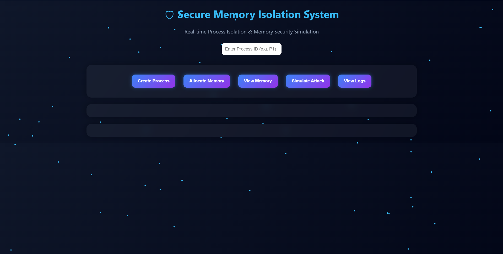
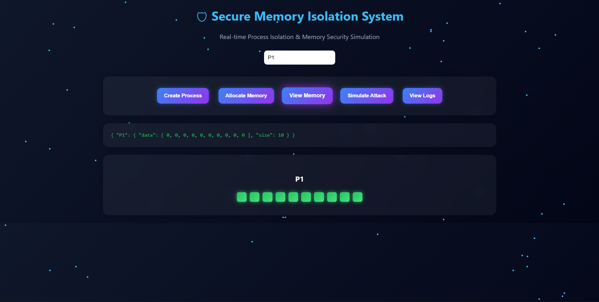
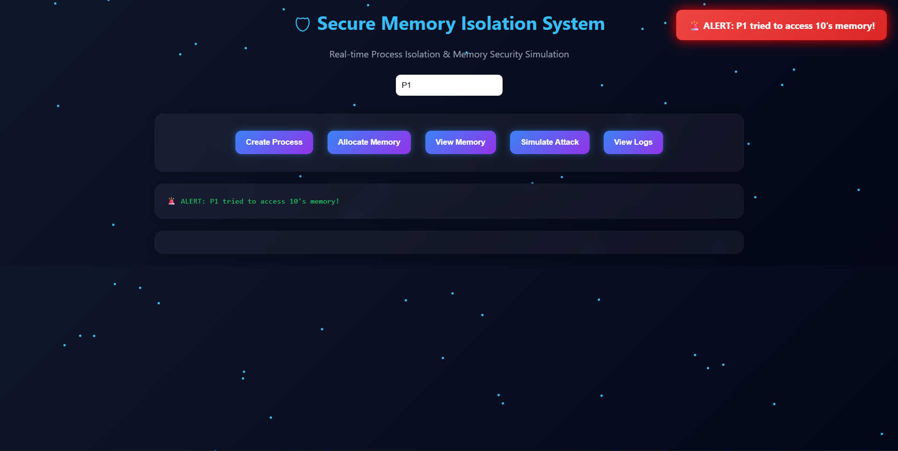
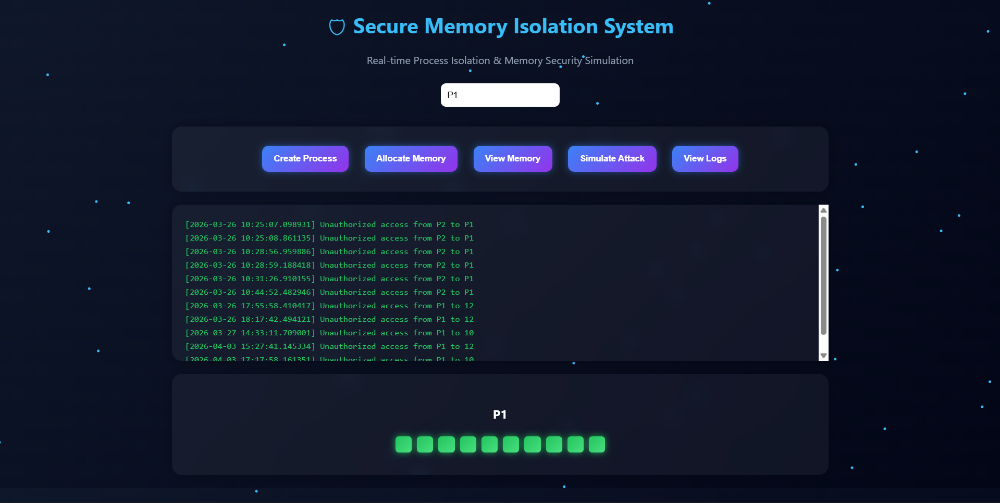

# 🛡 Secure Memory Isolation System

## 🚀 Overview

A cybersecurity simulation that demonstrates how operating systems isolate memory between processes to prevent unauthorized access.

---

## ✨ Features

* 🔐 Process-based memory isolation
* ⚙️ Memory allocation simulation
* 🚨 Attack detection system
* 📄 Logging mechanism
* 🎨 Interactive dashboard

---

## 📸 Screenshots

### Dashboard

### Memory Visualization

### Attack Detection

### Logs

